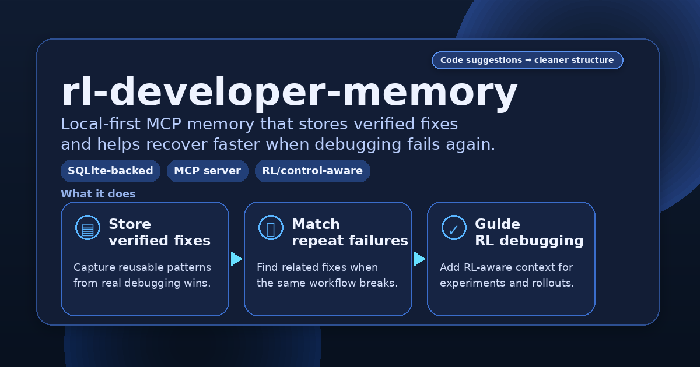

# rl-developer-memory

[](https://github.com/PhiniteLab/rl-developer-memory/actions/workflows/ci.yml)
[](LICENSE)
[](pyproject.toml)
[](https://github.com/PhiniteLab/rl-developer-memory/releases)



`rl-developer-memory` is a **local-first MCP server for Codex** that stores reusable debugging knowledge in SQLite, ranks prior fixes for recurring failures, and adds an optional **RL/control-aware audit layer** for experiment-heavy workflows.

The repository is designed for teams and solo developers who want:
- a local memory of verified fixes,
- a small operational surface,
- explicit rollout and validation discipline,
- and a public repo that is easy to install, read, and maintain.

## What you get

This repository ships three public surfaces:

1. **MCP server**: `python -m rl_developer_memory.server`
2. **Maintenance CLI**: `rl-developer-memory-maint`
3. **Repository tooling**: install, verification, examples, skill sync, and release-readiness scripts

- **MCP surface:** a focused set of reusable retrieval, review, preference, and reporting tools
- **Maintenance surface:** a comprehensive CLI for lifecycle, backup, rollout, calibration, diagnostics, and release-readiness checks

## Key capabilities

- Store reusable issue patterns, variants, episodes, feedback, preferences, and review items in local SQLite.
- Retrieve ranked prior fixes through MCP tools such as `issue_match`, `issue_get`, and `issue_guardrails`.
- Run lifecycle, backup, restore, rollout, calibration, and diagnostics commands from one CLI.
- Operate in generic debugging mode or in RL/control-aware shadow and active rollout modes.
- Keep runtime state local to your Linux or WSL filesystem.

## Repository layout

```text
.
├── src/rl_developer_memory/   # Python package and MCP server
├── tests/                     # unit, integration, regression, and smoke tests
├── docs/                      # focused user and operator documentation
├── examples/                  # runnable RL/control scenarios and outputs
├── scripts/                   # install, verification, and helper scripts
├── configs/                   # example rollout and backbone configs
├── templates/                 # example config and integration templates
└── .github/workflows/         # CI and release automation
```

## Requirements

### Supported environment

- **OS**: Linux or WSL 2
- **Python**: 3.10, 3.11, or 3.12
- **Shell**: Bash-compatible shell for the bundled install scripts
- **Filesystem**: keep the active database on the local Linux/WSL filesystem, not `/mnt/c/...`

### System tools you may need

| Tool | Required | Why |
| --- | --- | --- |
| `git` | Yes | Clone the repository |
| `python3` + `venv` | Yes | Create the project environment |
| `pip` | Yes | Install Python dependencies |
| `bash` | Yes | Run install and verification scripts |
| `rsync` | Optional | Faster/safer bundle copy in `install.sh` |
| `cron` / `crontab` | Optional | Scheduled backups |
| Codex | Optional | Needed only for live MCP registration |

### Python dependencies

The runtime dependency surface is intentionally small.

**Installed automatically by the package:**
- `mcp[cli]>=1.0.0,<2.0.0`
- `tomli>=2.0.1` on Python `<3.11`

**Recommended for development and release checks:**
- `pytest>=8.0.0`
- `pyright>=1.1.380`
- `ruff>=0.6.0`
- `build>=1.2.2`

## Installation

### Option A — recommended local install

Use this when you want the full local runtime, verification flow, and Codex registration support.

```bash
git clone https://github.com/PhiniteLab/rl-developer-memory.git
cd rl-developer-memory
bash install.sh
bash scripts/install_skill.sh --mode copy
bash scripts/verify_install.sh
```

What this does:
- creates the runtime directories,
- creates a virtual environment,
- installs the package,
- initializes the SQLite database,
- writes a calibration profile,
- creates an initial backup,
- registers the MCP block in `~/.codex/config.toml`,
- and verifies the local install.

### Option B — source checkout / development install

Use this when you want to work directly from the repository.

```bash
python3 -m venv .venv
. .venv/bin/activate
python -m pip install --upgrade pip setuptools wheel
python -m pip install -e .[dev]
python -m rl_developer_memory.maintenance init-db
```

If you also want to build release artifacts locally:

```bash
python -m build
```

## First commands to run

After installing, these are the most useful first checks:

```bash
rl-developer-memory-maint smoke
rl-developer-memory-maint doctor --mode shadow --max-instances 0
rl-developer-memory-maint server-status
rl-developer-memory-maint e2e-mcp-reuse-harness --json
python scripts/release_readiness.py --json
```

## Minimal usage examples

### 1) Retrieve a previous fix through Python

```python
from rl_developer_memory.app import RLDeveloperMemoryApp

app = RLDeveloperMemoryApp()
result = app.issue_match(
    error_text="sqlite3.OperationalError: database is locked",
    command="python train.py",
    file_path="tracking/sqlite_index.py",
    project_scope="rl-lab",
)
print(result["decision"])
```

### 2) Store a verified reusable fix

```python
app.issue_record_resolution(
    title="CLI import fails under the wrong interpreter",
    raw_error="ModuleNotFoundError: No module named requests",
    canonical_fix="Run the CLI inside the project virtual environment.",
    prevention_rule="Pin the launcher to the intended interpreter.",
    verification_steps="Re-run the CLI inside the same virtual environment.",
    project_scope="global",
)
```

### 3) Run the bundled RL examples

```bash
PYTHONPATH=src .venv/bin/python examples/run_rl_scenarios.py \
  --output-json /tmp/rl_scenarios_metrics.json \
  --output-markdown /tmp/rl_scenarios_summary.md
```

This avoids overwriting the committed sample snapshots under `examples/results/`.

## Configuration notes

- Live MCP runtime authority is `~/.codex/config.toml`.
- Prefer `RL_DEVELOPER_MEMORY_MAIN_CONVERSATION_KEY` for main-conversation ownership.
- Treat duplicate exit code `75` as a reuse signal, not as a generic crash.
- Default rollout posture should remain **shadow** until you have explicit validation evidence for stronger rollout.

## Validation and release readiness

Use the canonical validation matrix in [`docs/VALIDATION_MATRIX.md`](docs/VALIDATION_MATRIX.md).

Quick local sanity check:

```bash
ruff check .
pyright
python -m pytest
```

Full release-readiness report:

```bash
python scripts/release_readiness.py --json
```

That report covers install/runtime assumptions, docs-command consistency, reuse behavior, RL reporting checks, and conservative rollout readiness.

## Documentation map

- [docs/README.md](docs/README.md) — documentation index
- [docs/releases/v0.1.0.md](docs/releases/v0.1.0.md) — curated release notes for `v0.1.0`
- [docs/INSTALLATION.md](docs/INSTALLATION.md) — installation and verification details
- [docs/USAGE.md](docs/USAGE.md) — MCP, CLI, and Python usage patterns
- [docs/CONFIGURATION.md](docs/CONFIGURATION.md) — runtime configuration model
- [docs/OPERATIONS.md](docs/OPERATIONS.md) — backup, restore, diagnostics, and lifecycle operations
- [docs/DEPENDENCIES.md](docs/DEPENDENCIES.md) — dependency policy and install notes
- [docs/ARCHITECTURE.md](docs/ARCHITECTURE.md) — runtime and data-flow overview
- [docs/RL_BACKBONE.md](docs/RL_BACKBONE.md) — RL development backbone layout
- [docs/THEORY_TO_CODE.md](docs/THEORY_TO_CODE.md) — theorem/assumption/objective mappings to code
- [docs/RL_CODING_STANDARDS.md](docs/RL_CODING_STANDARDS.md) — coding and delivery standards for RL/control work
- [docs/MEMORY_SCOPE_OPERATIONS_NOTE.md](docs/MEMORY_SCOPE_OPERATIONS_NOTE.md) — scope-selection and write-back hygiene
- [docs/RL_QUALITY_GATE.md](docs/RL_QUALITY_GATE.md) — minimum RL engineering acceptance gate
- [docs/SKILL_INSTALL_SYNC.md](docs/SKILL_INSTALL_SYNC.md) — portable global skill sync for `.codex`/`.agents`
- [examples/README.md](examples/README.md) — runnable example scenarios

## Community and project standards

- [CONTRIBUTING.md](CONTRIBUTING.md) — contributor workflow
- [CODE_OF_CONDUCT.md](CODE_OF_CONDUCT.md) — community expectations
- [SECURITY.md](SECURITY.md) — private vulnerability reporting and response expectations
- [SUPPORT.md](SUPPORT.md) — support expectations, troubleshooting route, and issue routing
- [CHANGELOG.md](CHANGELOG.md) — notable public-facing changes

## GitHub issue routing

- Use the **Bug report** template for reproducible install, runtime, validation, rollout, or matching problems.
- Use the **Feature request** template for scoped improvements.
- Use [SECURITY.md](SECURITY.md) for vulnerabilities; do **not** put exploit details in a public issue.
- Use [SUPPORT.md](SUPPORT.md) before opening usage or environment questions.

## Branch policy

- `main` is the only long-lived branch for this repository.
- Short-lived topic branches are acceptable during active work, but they should be deleted immediately after merge.
- This repository does not keep permanent automation branches; dependency updates should land through reviewed changes on `main`.

## License

MIT. See [LICENSE](LICENSE).
